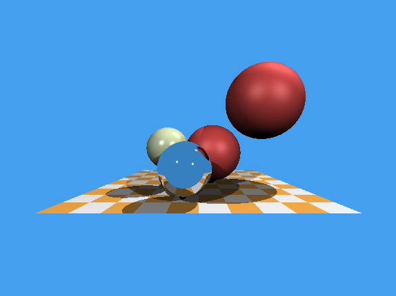

# Simple Ray Tracer

A simple CPU ray tracer built in C++ to learn about the fundamentals of how ray tracing graphics work. To avoid having to interface with any graphics APIs, this program just directly spits out a rendering of the scene as a `.ppm` file.



## Building

```
mkdir build
cd build
cmake ..
make
```

## Resources

- [ssloy/tinyraytracer](https://github.com/ssloy/tinyraytracer)
